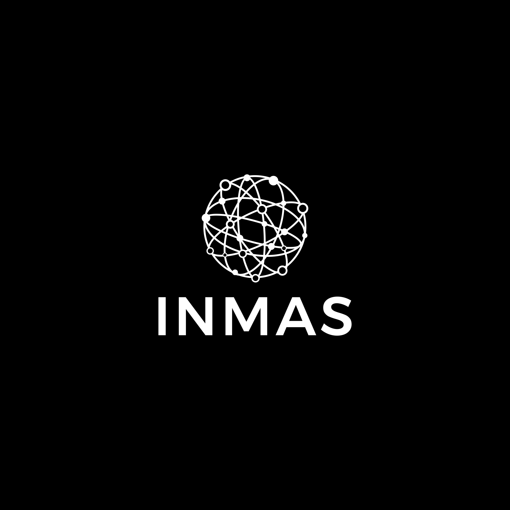

# The Internship Network in the Mathematical Sciences
## Workshop #1 - Introduction to Python and its Scientific Software Stack
## Solutions to Exercise Notebooks

This material is part of the INMAS training Workshop Series. 

This repository only contains the solutions to the exercise Notebooks part of the Workshop. Convention used:
- **N**:  Files starting with *N* present the material to learn in jupyter notebooks and use the RISE extension for viewing them
- **X**:  Files starting with *X* contain exercises associated with the material notebook having the same number and name. These exercises are meant to be solved using jupyter, with the assistance of a command line terminal for some exercises.
- **Z**:  Files starting with *Z* contain the solutions to the exercises. For obvious reasons, they are distributed separately from the *N* and *X* files. 

This Workshop is a basic introduction to Scientific Python which lays the foundations required for the rest of the INMAS program.
Python has been selected as a language of choice due to its ubiquitous use in the industry and the reduced time, compared to other popular languages, for developing a prototype application.
This is mainly thanks to the broad availibility of modules that were developed for the language, allowing to interface with many other programming languages (e.g., C), applications (e.g., Excel), and interfaces (e.g., the web or the operating system).

This workshop is aimed at beginner students as well as students with more advanced proficiency.
The material in this workshop is adjusted so that students with different levels of
proficiency can each learn and be challenged.
This is achieved by interweaving more advanced concepts with simple ones,
and providing more advanced, optional exercices for the most proficient students.

We anticipate that students will have sufficient time to assimilate the core parts of the training during the Workshop.
We suggest students revisit these notebooks at a later time.
This will help assimilating the material and ensure a continuity in practicing a new programming language.

The Workshop is structured in 6 parts as follows:

| *Learning Block* | *Notebooks* |  *Exercises and Projects* |
| ---------| --------------------------|  ---|
| **1. Introduction to Python** | 00 to 03 | Exercises 00 to 03|
| **2. Python Fundamentals** | 04 to 09 | Exercises 00 to 08 and Mini-Project 09 |
| **3. Intermediate Concepts** | 10 to 13 | Exercises 10 to 13 |
| **4. Scientific Python** | 14 to 19 | Exercises 14 to 19 |
| **5. Additional Topics** | 20 to 23 | Exercises 21 to 23 and Mini-Project 20 |
| **6. Final Project** | 24 | Project 24 |

All learning notebooks are written with the RISE extension allowing to follow the material through slides.
These notebooks start with the letter *N*. Each of these notebooks have an associated exercise notebook
named with the starting letter *X* and with the same sequence number and title. Exercise notebooks
are not written with the RISE extension, except for the first one (00). They are meant to be completed
by the student in normal viewing mode.

All notebooks are anticipated to be read with the *classic* Jupyter Notebook, i.e., not JupyterLab nor Google's Colab.
This is because the RISE extension is still not fully functional and debugged on these platforms.

### Credits
A first version of this course was developed by Emily Shinkle, Shinhae Park, Adriana Morales Miranda,
Luke Leisman, Martin Lacasse, and many teaching assistants (TAs) who have provided valuable feedback and improvements.
Current version is the result of a significant overhaul done by Martin Lacasse in 2024,
reorganizing, adding, and removing material and exercises,
and restructuring the workshop to be more adaptable to the students' and instructors' needs.
This includes using the material for individual learning, as well as for standard or flipped classroom approaches.

While a good fraction of the modules have original content, some material
was taken, borrowed, inspired, from the following open-source projects:
- For material in the Primers modules
	- [Software Carpentry](https://software-carpentry.org)
	- [Notebook Community](notebook.community)
- For basic I/O
	- [Joseph Santarcangelo](https://colab.research.google.com/github/computationalcore/introduction-to-python/blob/master/notebooks/4-files/PY0101EN-4-1-ReadFile.ipynb#scrollTo=f2BMjBjox2_-)
- For Primers material, functions and methods, I/O, and NumPy, SciPy
	- [JR Johansson](https://github.com/jrjohansson/scientific-python-lectures)
- Debugging
	- [Spiro Sideris](https://github.com/spiside/pdb-tutorial)
- Scientific Python
    - [Fedor Iskhakov](https://github.com/fediskhakov/CompEcon)
- OpenAI
    - [Kie Codes](https://github.com/kiecodes)
